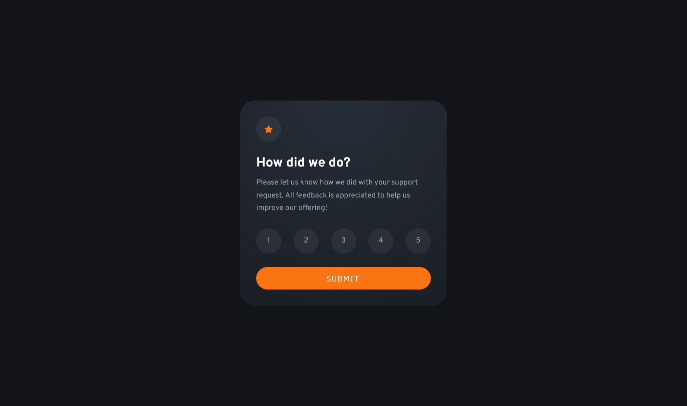
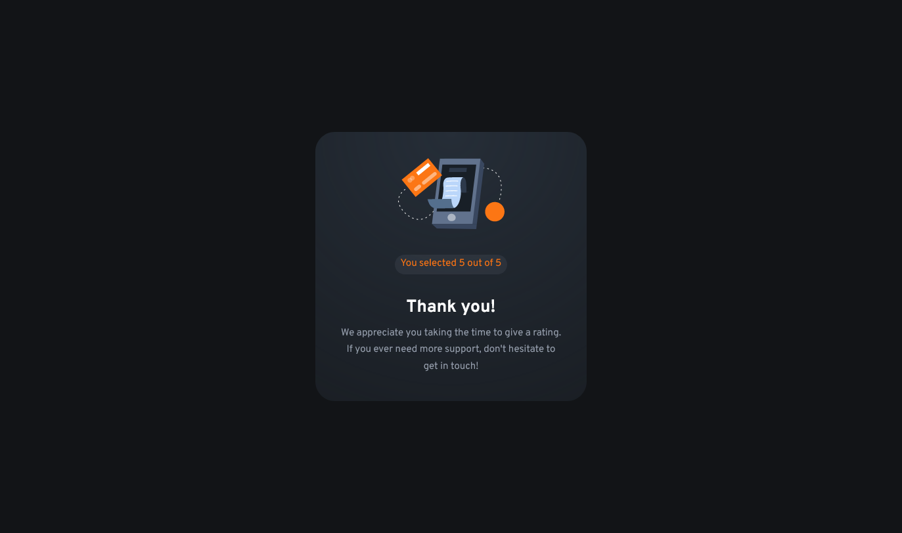

# Frontend Mentor - Interactive rating component solution

This is a solution to the [Interactive rating component challenge on Frontend Mentor](https://www.frontendmentor.io/challenges/interactive-rating-component-koxpeBUmI). Frontend Mentor challenges help you improve your coding skills by building realistic projects. 

## Table of contents

- [Overview](#overview)
  - [The challenge](#the-challenge)
  - [Screenshot](#screenshot)
  - [Links](#links)
- [My process](#my-process)
  - [Built with](#built-with)
  - [What I learned](#what-i-learned)
  - [Useful resources](#useful-resources)
- [Author](#author)

## Overview

### The challenge

Users should be able to:

- View the optimal layout for the app depending on their device's screen size
- See hover states for all interactive elements on the page
- Select and submit a number rating
- See the "Thank you" card state after submitting a rating

### Screenshot

Rating State

Submited State 

### Links

- Solution URL: [GitHub](https://your-solution-url.com)
- Live Site URL: [Live Site](https://your-live-site-url.com)

## My process

### Built with

- HTML
- CSS custom properties
- Flexbox

### What I learned

On this peoject, I learned how to use JavaScript to manipulate the DOM to change the display states, capture the ratings, and update the HTML to accurately show what rating was selected.

### Useful resources

- [MDN](https://developer.mozilla.org/en-US/) - When I became stuck or didn't fully understand something I used the MDN to figure it out.

## Author

- Website - [Jason Guzman](https://github.com/jsngzm)
- Frontend Mentor - [@jsngzm](https://www.frontendmentor.io/profile/jsngzm)